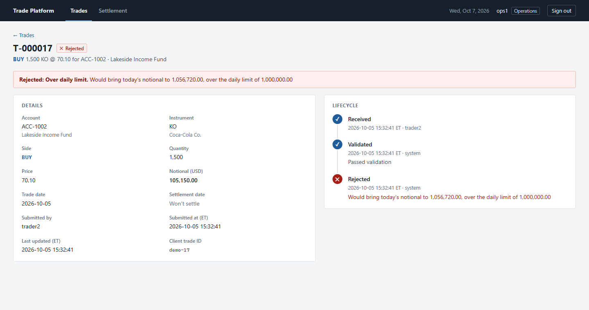
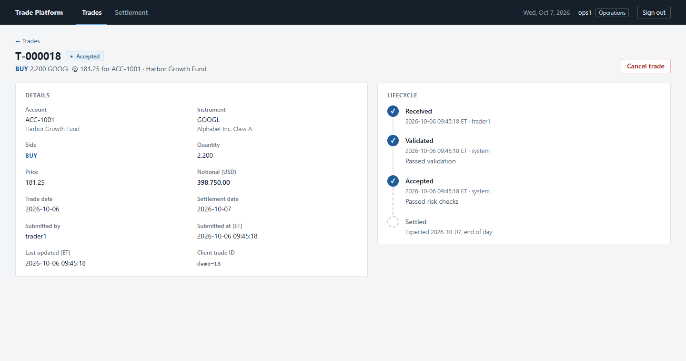
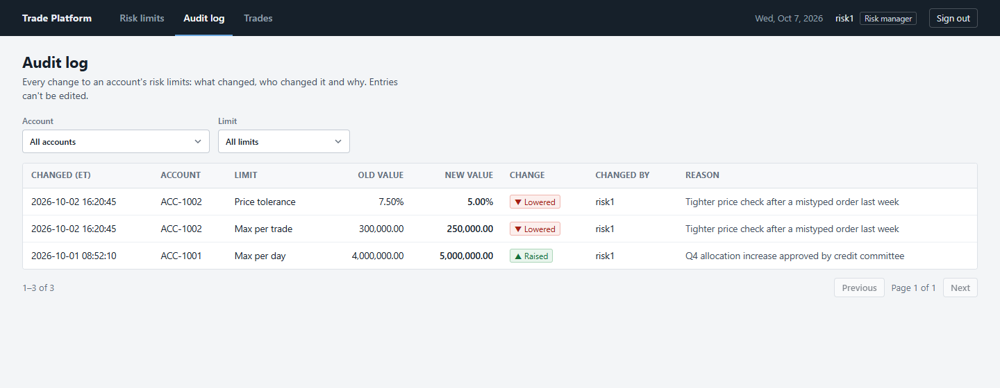
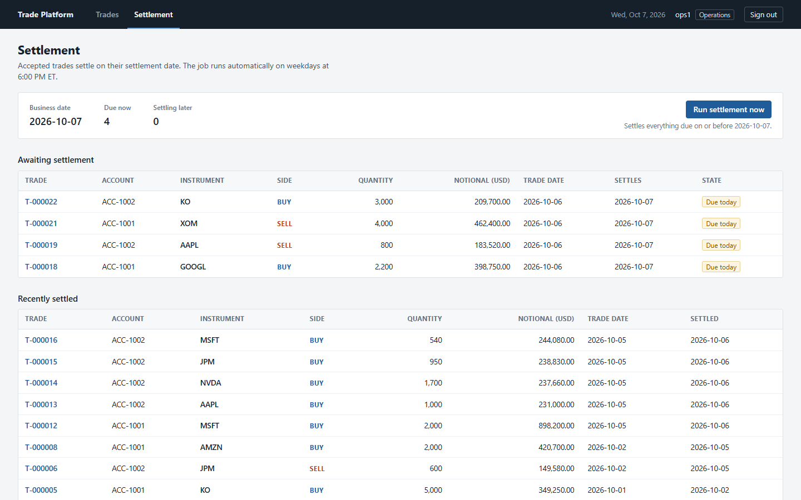

# Trade Processing Platform

A simplified version of what happens to an equity trade after someone books it. The trade is
validated, checked against the account's risk limits, accepted or rejected with a reason, and
settled one business day later. Every step is recorded, so you can always see what happened to
a trade and who did it.

I built this to learn how a system like this handles the parts that matter more than the happy
path: duplicate requests, two people changing the same thing at once, audit trails, and making
sure each role can only do what it's supposed to.


## What it does

- **Trade entry**: traders book buy/sell trades for an account and a US stock. The form shows the
  notional and settlement date before submitting.
- **Validation and risk checks**: suspended accounts and untradable instruments are rejected,
  then three per-account limits are checked: price close enough to the reference price, max
  notional per trade, and max notional per day.
- **Lifecycle and history**: every status change is stored with a timestamp, the user (or
  `system`) and a reason, and shown as a timeline on the trade page.
- **Risk limit management**: risk managers can set and change limits. Every change records the
  old value, new value, who changed it and why, in an audit log.
- **Settlement**: a scheduled job settles accepted trades on their settlement date (T+1).
  Operations can also run it by hand.
- **Cancellations**: operations can cancel an accepted trade before it settles, with a reason.
- **Duplicate protection**: resubmitting the same trade (say, after a timeout) returns the
  original instead of booking it twice.

## Trade lifecycle

```
RECEIVED ──> VALIDATED ──> ACCEPTED ──> SETTLED
    │            │             │
    └> REJECTED <┘             └──> CANCELLED
```

A rejected trade is still stored (and the API returns 201), because the trade was recorded and
rejecting it is a normal outcome. A request that's malformed or refers to an account or symbol
that doesn't exist is a 400 and nothing is stored.

| A rejected trade | An accepted one, waiting to settle |
|---|---|
|  |  |

## Roles

| Role         | Can                                             | Sees            |
|--------------|-------------------------------------------------|-----------------|
| Trader       | Submit trades                                   | Their own trades |
| Operations   | Cancel accepted trades, run settlement          | All trades      |
| Risk manager | Set and change risk limits, read the audit log  | All trades      |

The UI only shows each role its own pages, but every rule is enforced by the backend.
The rules are all in `SecurityConfig`.

## Stack

- **Backend**: Java 21, Spring Boot 4 (Web MVC, Data JPA, Security, Validation), Flyway, PostgreSQL 17
- **Frontend**: React 19, TypeScript, React Router, Vite. Plain CSS with no component library.
- **Tests**: JUnit 5 with Testcontainers (real Postgres), Vitest and Testing Library
- **Tooling**: Maven wrapper, Docker Compose for the local database, GitHub Actions

## Running it locally

You need JDK 21, Node 22+ and Docker.

```bash
docker compose up -d                 # Postgres on localhost:5432

cd backend
./mvnw spring-boot:run               # API on localhost:8080

cd frontend
npm install
npm run dev                          # UI on http://localhost:5173
```

The first start loads a few days of sample trades, so there's something to look at.

### Demo users

All use the password `demo-pass`.

| User      | Role         |
|-----------|--------------|
| `trader1` | Trader       |
| `trader2` | Trader (to check traders can't see each other's trades) |
| `ops1`    | Operations   |
| `risk1`   | Risk manager |

Things worth trying:

1. As `trader1`, book a trade that goes over a limit (e.g. 5,000 AAPL on ACC-1002) to see the rejection, then use "Amend and resubmit".
2. As `ops1`, run settlement: the sample trades from the last business day are due today (on a weekday) and settle.
3. As `risk1`, change a limit and check the audit log.

## Tests

```bash
cd backend && ./mvnw test            # needs Docker running (Testcontainers)
cd frontend && npm test
```

The backend tests run against a real Postgres in a container, because several of them are
about row locks and unique constraints, which an in-memory database wouldn't behave the same
way for. A test clock replaces the real one, so "today" is whatever a test says it is.

## Some decisions worth explaining

**Locking for the daily limit.** Two trades for the same account arriving together could both
read the same "used today" total and both pass. The risk check locks the account's limit row
(`SELECT ... FOR UPDATE`) so checks for one account run one at a time. A test fires 8 trades at
once against a limit that fits 4. Without the lock all 8 got accepted.

**Duplicate submissions.** The trade form generates a `clientTradeId` once per trade, not per
click. Submitting the same one again returns the original trade. If two identical requests
race past the "does it exist?" lookup, a unique constraint stops the second insert and the
service returns the trade the first one created.

**Settlement can run twice.** The job settles each trade in its own transaction and re-checks
the status inside it, and `@Version` on the trade catches a cancel and a settle racing each
other. Running it again finds nothing to do. A test runs three settlement jobs at the same time
and checks every trade settled exactly once.

**Two risk managers editing at once.** A limit edit sends the version it loaded. If someone else
saved first, the second person gets a 409 that says who changed it, instead of silently
overwriting their change.

**Sessions instead of JWT.** There's one backend, so I used Spring Security's normal session login
with an HttpOnly cookie rather than storing tokens in the browser. CSRF protection stays on,
using a cookie the frontend sends back as a header.

**Time zones.** Trade dates are New York business dates, and the UI shows timestamps in New York
time (labelled ET). Otherwise a trade booked at 9pm ET would look like next day's trade to
someone in Europe.

More detail is in [docs/design-notes.md](docs/design-notes.md).

## What's not done

- Accounts aren't assigned to traders, so any trader can book on any account.
- Market holidays aren't modeled, only weekends.
- No user management or login rate limiting; the demo users come from a migration.
- Validation and risk checks run inside the submit request. If they had to call slower external
  systems, I'd move them to a background worker with retries.
- Not deployed anywhere yet.

## Project layout

```
backend/src/main/java/com/tradeplatform/
  trade/        trade entity, lifecycle, submission, queries
  risk/         risk checks, limit editing, audit records
  settlement/   scheduled settlement job
  security/     login, roles, SecurityConfig
  account/, instrument/, common/
backend/src/main/resources/db/
  migration/    Flyway schema migrations
  demo/         sample data for local runs
frontend/src/
  pages/        one file per screen
  components/   layout and shared UI pieces
  api/          fetch wrapper and types
```

<details>
<summary>More screenshots</summary>





</details>
