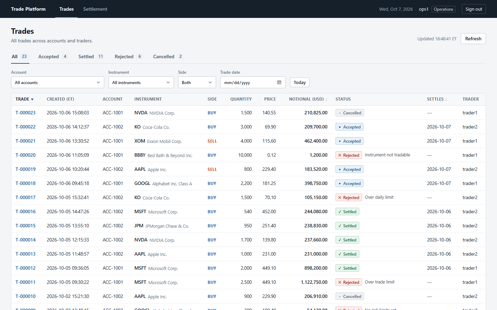
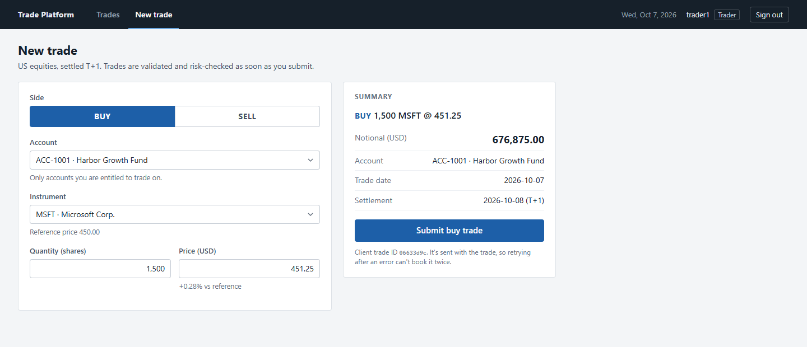
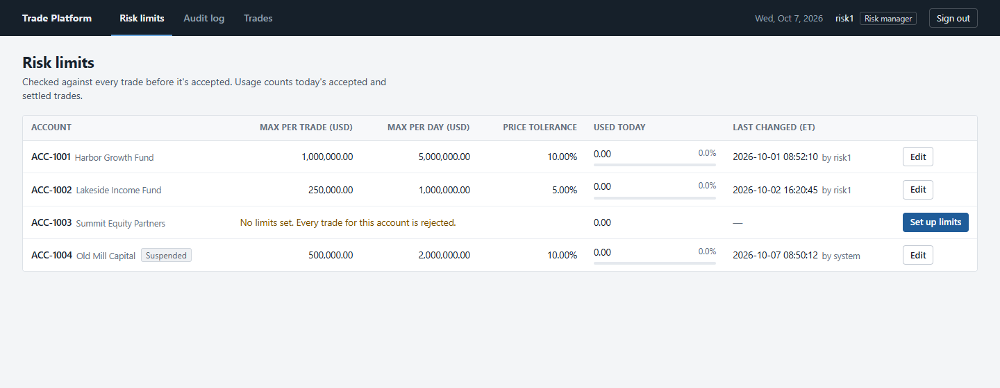

# Trade Processing & Risk Platform

A simplified version of what happens to a US equity trade after a trader books it. The trade is
checked against the trader's account entitlements and the account's risk limits, then accepted
or rejected with a reason, and settled one business day later (T+1). Every step is recorded, so
you can always see what happened to a trade, who did it and why.



## Features

- **Trade lifecycle**: `RECEIVED → VALIDATED → ACCEPTED → SETTLED`, or `REJECTED` / `CANCELLED`
  with a reason. Each trade has a timeline of every status change.
- **Risk controls**: per-account limits on price (vs. a reference price), notional per trade and
  notional per day. Risk managers can change them, with a required reason.
- **Account entitlements**: traders can only book trades on the accounts they're assigned to.
- **Duplicate protection**: resubmitting the same trade (after a timeout, say) returns the original
  instead of booking it twice.
- **Audit trail**: every risk limit change records the old value, the new value, who changed it and why.
- **Settlement**: a scheduled job settles accepted trades on their settlement date. Operations can
  also run it by hand.
- **Role-based access**: traders, operations and risk managers each get their own pages and
  actions, enforced by the backend.

| Trade detail | New trade | Risk limits |
|---|---|---|
|  |  |  |

## Tech stack

Java 21, Spring Boot 4 (Web MVC, Data JPA, Security), PostgreSQL 17, Flyway, React 19 with
TypeScript and Vite, JUnit 5 with Testcontainers, Vitest, Docker Compose, GitHub Actions.

## Running locally

### With Docker (easiest)

Needs Docker Desktop. This builds and starts the database, backend and frontend:

```powershell
docker compose up --build
```

Then open http://localhost:3000. The first build takes a few minutes. Stop it with `Ctrl+C`, and
use `docker compose down -v` if you want to start over with fresh demo data.

### Running the backend and frontend yourself

Needs JDK 21, Node 22+ and Docker Desktop (for the database).

**Windows (PowerShell)**: run one line at a time from the project folder (Windows PowerShell
doesn't support `&&`).

```powershell
docker compose up -d postgres
cd backend
.\mvnw.cmd spring-boot:run
```

Then, in a second PowerShell window, from the project folder:

```powershell
cd frontend
npm.cmd install
npm.cmd run dev
```

(`npm.cmd` works even when PowerShell's execution policy blocks `npm.ps1`. Plain `npm` is fine if
your policy allows it.)

**macOS / Linux**:

```bash
docker compose up -d postgres
cd backend && ./mvnw spring-boot:run
cd frontend && npm install && npm run dev    # in a second terminal
```

Open http://localhost:5173. Either way, the database starts with a few days of sample trades.

### Demo users

These are **local demo credentials** created by a database migration. All use the password `demo-pass`.

| User      | Role         | Entitled accounts            |
|-----------|--------------|------------------------------|
| `trader1` | Trader       | ACC-1001, ACC-1002, ACC-1004 |
| `trader2` | Trader       | ACC-1002, ACC-1003, ACC-1004 |
| `ops1`    | Operations   | (doesn't book trades)        |
| `risk1`   | Risk manager | (doesn't book trades)        |

Some things to try: as `trader1`, book 5,000 AAPL on ACC-1002 to see a risk rejection; as `ops1`,
run settlement; as `risk1`, change a limit and look at the audit log.

## Testing

Windows PowerShell, from the project folder:

```powershell
cd backend
.\mvnw.cmd test
```

```powershell
cd frontend
npm.cmd test
npm.cmd run lint
npm.cmd run typecheck
```

On macOS/Linux use `./mvnw test` and `npm test`. The backend tests start a real Postgres in Docker
(Testcontainers), so Docker needs to be running. GitHub Actions runs both suites, the frontend
lint/type-check/build, and the Docker image builds on every push.

## Implementation notes

**Concurrent daily limit checks.** Two trades for the same account arriving together could both
read the same "used today" total and both pass. The risk check locks the account's limit row
(`SELECT ... FOR UPDATE`), so checks for one account run one at a time. A test fires 8 trades at
once against a limit that only fits 4; without the lock, all 8 were accepted.

**Duplicate requests.** The trade form generates a `clientTradeId` once per trade, not per click.
Sending the same one again returns the original trade. If two identical requests race past the
"does it exist?" lookup, a unique constraint stops the second insert and the first trade is returned.

**Settlement can run twice.** Each trade settles in its own transaction, its status is re-checked
inside it, and `@Version` on the trade catches a cancel and a settle racing each other. A test
runs three settlement jobs at the same time and checks every trade settled exactly once.

**Entitlements are checked first.** This happens before the duplicate lookup, so resubmitting an
existing trade can't get around it. An account code that doesn't exist gets the same 403 as one
you aren't entitled to, so the API doesn't reveal which accounts exist.

**Sessions instead of JWT.** There's only one backend, so login uses a normal Spring Security
session with an HttpOnly cookie instead of a token stored in the browser. Because the session is
a cookie, CSRF protection stays on.

More detail is in [docs/design-notes.md](docs/design-notes.md).

## Not done yet

- No market holiday calendar (weekends are skipped, holidays aren't).
- No login rate limiting, user management or screen for editing entitlements; users and
  entitlements come from migrations.
- Not deployed anywhere.
